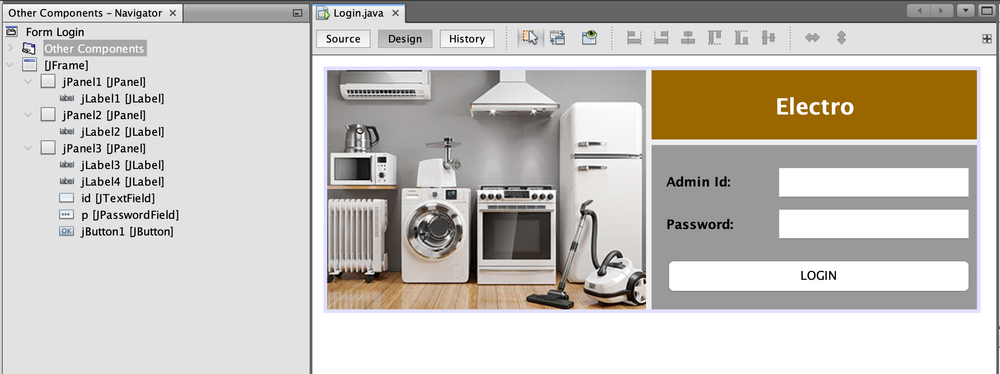
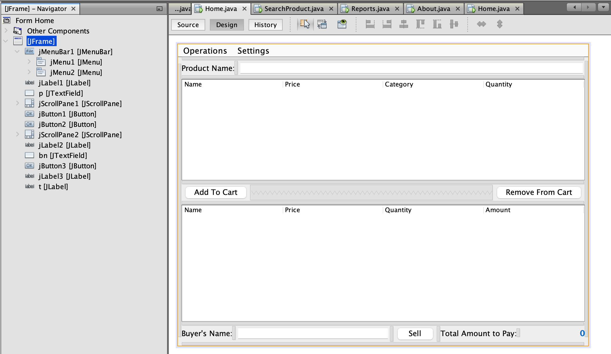
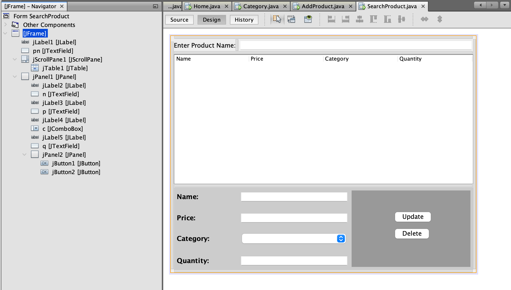
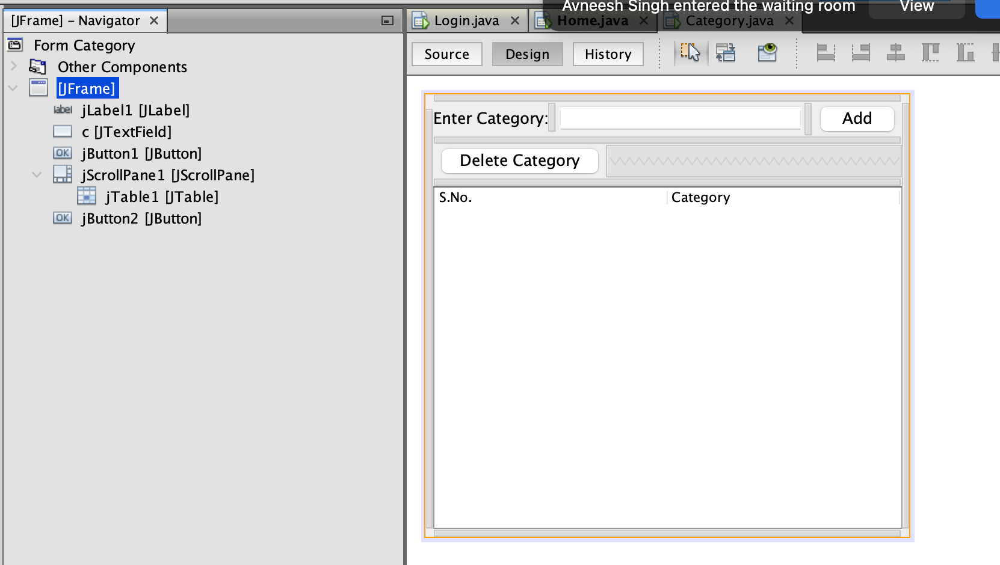
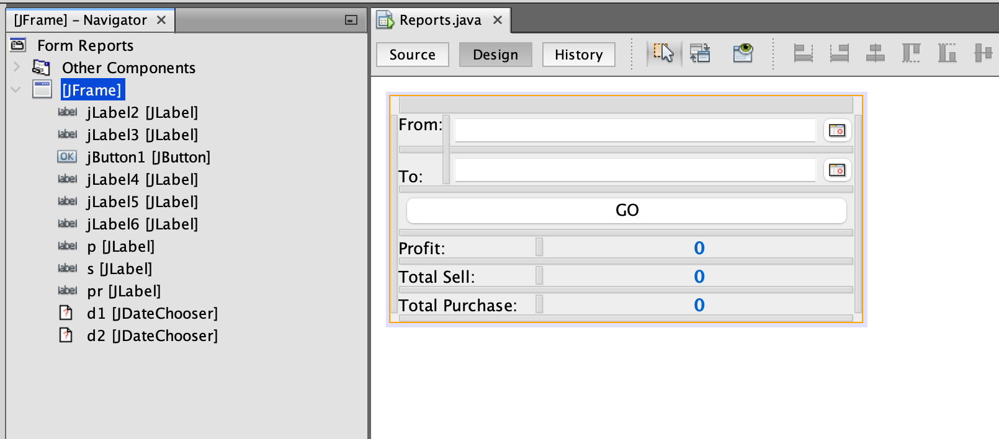

# ⚡ Electro Shop Management System

A Java Swing and MySQL based desktop application for managing an electronic products shop. The system allows admin login, product management, category handling, billing, inventory tracking, product search, cart operations, and sales reports generation.

---

# 🚀 Features

- Admin Login Authentication
- Add New Products
- Manage Product Categories
- Search Products
- Add To Cart System
- Remove From Cart
- Billing & Selling Module
- Sales Reports
- Inventory Management
- Profit Calculation
- User-Friendly Java Swing GUI
- MySQL Database Connectivity

---

# 🛠 Technologies Used

## Frontend

- Java Swing
- Java AWT

## Backend

- Core Java

## Database

- MySQL

## IDE

- NetBeans IDE

---

# 📂 Modules

## 🔐 Login Module

Secure admin login system with authentication.

## 📦 Product Module

Add, update, delete, and search products.

## 🗂 Category Module

Manage product categories easily.

## 🛒 Cart & Billing Module

Add products to cart and generate total bill.

## 📊 Reports Module

Generate sales and profit reports.

## ℹ About Module

Displays project and developer information.

---

# 🖼 Project Screenshots

## Login Page



## Home Dashboard



## Product Search



## Category Management



## Reports Module



---

# 🗄 Database Tables

- admin
- category
- product

---

# 🔑 Default Admin Login

```txt
Admin ID : admin
Password : admin123
```

---

# ⚙ How To Run Project

1. Open project in NetBeans IDE
2. Start MySQL Server
3. Create database named:

```sql
electro
```

4. Import database tables
5. Configure database connection in Java project
6. Run Login.java file
7. Login using admin credentials

---

# 📧 Contact

## 👨‍💻 Developer

Harshit Raj

📧 Email: your- harshitraj7304845705@gmail.com

🔗 LinkedIn:
https://linkedin.com/in/harshit-raj-35a657229

🔗 GitHub:
https://github.com/harshitraj7304

---

# ⭐ Project Highlights

- Desktop-based Java Application
- Inventory & Billing System
- Admin Dashboard
- Sales Reporting
- Easy To Use Interface
- Real-Time Product Management

---

# 📜 License

This project is developed for educational and learning purposes.
